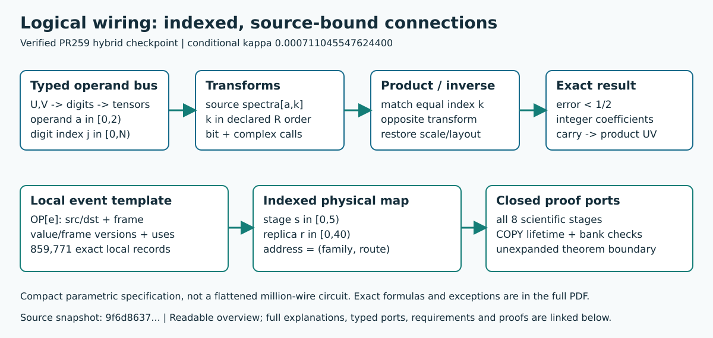

# Logical and Functional Diagrams, Explanations, and Build Tools

This package documents the verified PR259-derived construction checkpoint in
[PR #277](https://github.com/CrocSwap/integer-mult-bounds/pull/277).
[Exact public construction source and reproduction instructions](https://github.com/hcg890/integer-mult-bounds/blob/c2f07d311bfdad0d89bf961e4da133ee97bb78de/research/multicut-delayed-inverse-checkpoint/README.md)
are pinned to commit `c2f07d311bfdad0d89bf961e4da133ee97bb78de`.
The approved public source manifest is pinned below.
The later PR266 result is stronger; this checkpoint's conditional exponent is
0.000711045547624400.

[Open the complete functional architecture](functional_architecture.pdf)

[Open the complete logical/wiring document](logical_wiring.pdf)

## Read the diagrams

Each PDF has contents, outline bookmarks, clickable block explanations,
requirements, source anchors and cross-page references. The separate
complete_system.pdf combines both views.

There are three deliberately separate layers:

1. The full integer-product hierarchy preserves all 87 original A/B/C/R/D block
   IDs. The outer algorithm and inherited theorem interfaces remain explicit
   contracts. Historical source471 internals are not silently treated as the
   current source527 implementation.
2. F01-F21 explain the selected current construction. All 53 declared block
   dependencies name their input/output ports. These are architecture and
   evidence dependencies, not scalar-operation edges.
3. JOINT259_CONNECTION_EXTRACT.py reconstructs the exact selected local
   operation/value/frame connection inventory and the indexed global address
   map. The ordinary diagrams use compact buses and templates instead of drawing
   millions of repeated edges.

All 53 original typed relations and 75 documentary relations are retained in
hierarchy_edges.json with current scope classifications. A historical relation
is never promoted to current physical execution merely because its names match.

The selected composition is: exact PR249's 21 entrances; 513 of PR259's 518
cohorts; seven closed delayed-inverse intervals replacing five conflicting
quartets; the same 25 PR258/PR260 retimings applied once. PR251's extra sixteen
entrances are excluded. PR254 is ancestry, not an additional independent gain.

## Rebuild PDF and SVG

Use Python 3.11 or later. Install the pinned dependencies:

    python -m pip install -r joint259_system_docs_requirements.txt

From this documentation directory, run:

    python -B joint259_system_docs_incremental.py --source /path/to/verified/construction --cache ./page-cache.json --output ./build-new --svg

The source may be the admitted construction directory or its ZIP. The approved
public manifest is 0af10dcca505cbd913cf1b9220a08b6a62687650ace4e3d1efd093e828e3990e:
137 total paths, including 136 manifest members and 117 unchanged numerical
source pins. The original tested archive is also admitted. Every file is checked;
unknown manifests, missing/extra files, symlinks and path aliases are rejected.
source_binding.json and QA.json distinguish the actual consumed manifest from
the scientific archive. The public documentation cleanup reuses that archive's
scientific execution evidence; documentation generation does not replay science.

Choose a new output directory for every build and reuse the cache file.
The source package is checked before and after the build and is never modified.
Use --clean to ignore the cache. Without --svg, PDF generation uses Python only.

Python dependencies:
- reportlab==4.4.9
- pypdf==6.10.0
- Pillow==12.3.0
- charset-normalizer==3.5.1

System dependencies:
- Graphviz is not used.
- SVG export requires Poppler pdftocairo on PATH. The tested converter is
  25.03.0; its actual executable/version is included in cache dependencies.
- Raster equivalence tests require pdftoppm. The tested version is 26.05.0.
- Document fonts are the Vera font bytes bundled in the pinned ReportLab wheel.
  No platform-installed fonts are needed for the PDFs or outlined page SVGs.
- The two small summary SVGs use ordinary vector text with explicit font sizes.
  They are rebuilt each time, separately from the page-render cache.

On macOS, Poppler is available from the official Homebrew package. On Debian or
Ubuntu it is provided by poppler-utils. Installing a different converter version
invalidates SVG cache entries; byte-identical SVG comparisons require the same
converter.

## What is regenerated

The one command regenerates both PDF families, the combined PDF, two PR summary
SVGs, linked per-page vector SVGs, source/requirement/connection indexes,
hierarchy reconciliation, sanitized scientific reproduction facts and build
receipts. Every diagram family consumes the same models.

The incremental build records each page's actual vector drawing commands, then
reuses only cache entries with matching schema, drawing plan, source/dependency
keys, font bytes and PDF hash. It always rebuilds navigation and current
indexes. Link-target-only changes can reuse a page's appearance while changing
its live links. Unchanged page drawings remain identical.

Cached visuals are not proof receipts. The cache is local build state with
staleness and accidental-corruption checks, not an authenticated database
against someone who can replace both data and its hashes.

[Detailed cache design, command options and tests](joint259_system_docs_incremental_README.md)

## Safe changes and the parser boundary

This is a reusable documentation and finite-IR extraction pipeline within its
declared formats. It is not an arbitrary-program architecture inference tool.

Automatic after a valid, explicitly reviewed input/model update:
- Re-extract source/destination and value/frame dependencies from supported
  local MOVE, ADD, COPY and ERASE records.
- Expand the supported five-stage and BankPlan index/address maps.
- Regenerate matching diagrams, block explanations, indexes and navigation.
- Repaint affected pages and compare incremental output against a clean build.

A reviewer must update the adapter/model when a new opcode, ownership rule,
address-map family, proof interface or narrative meaning appears. Unknown
source pins, undeclared ports, missing required inputs and unsupported local
operations fail; they must not silently reuse old explanations or receipts.
A source-byte change does not automatically establish a new mathematical proof.

Minimal update procedure:

1. Create a separately pinned construction snapshot and obtain its required
   scientific verification. Preserve the prior checkpoint.
2. Review source/IR compatibility, every changed proof interface and the active
   numerical pins. Update the source-binding configuration deliberately.
3. Update affected F blocks, ports, explanations, requirements and heritage.
   Reconcile changed A/B/C/R/D allocations and inherited contracts.
4. Run the exact connection extractor and its hostile tests from the new
   admitted outputs. Do not treat a matching dimension as a matching subspace.
5. Run a clean documentation build and a warm/changed build; compare outputs.
   Check every changed page visually at normal reading size.
6. Obtain independent mathematical/source and visual review, then record the
   exact deliverable hashes and actual construction PR number.

Compatible data changes are parsed; new semantics are reviewed. Current
checkpoint-specific source and result expectations are intentional guards.

## Test the rebuild behavior

    python -B joint259_system_docs_incremental_test.py --source /path/to/verified/construction --raster-dpi 40

Tests use in-memory controlled changes and do not edit scientific inputs.
They check:
- Cold, warm and changed clean/incremental PDF byte equality
- Original-renderer versus cached-renderer drawing streams, text and links
- Every PDF page's raster pixels at the requested resolution
- Block behavior, visible names, requirements, source-index metadata and wiring
- Added/deleted pages, stable-ID renames, index-formula changes and undo
- Internal and external link-target-only edits with zero unnecessary repainting
- Renderer/config/font/source dependency invalidation
- Damaged cache schemas, keys, hashes and page bytes
- Rejection of an unrecognized scientific source pin
- Vector-only SVG exports and preserved links

The recorded current suite covers 161 pages across 51-page functional,
54-page logical and 56-page combined documents. Measured example timings on the
cloud were 0.560 s cold, 0.375 s warm and 0.373 s for one behavior edit; that edit
repainted one of 56 master pages. These are documentation build measurements,
not multiplication runtime claims. Exact final timings and hashes are in
joint259_system_docs_incremental_test_report.json.

## Scientific and coverage boundary

The original scientific package manifest is
9f6d8637b9a119cfe4566a02ab2d704f23c502e5e4357b40c28ef85a3fd4de89.
Its selected raw word is
acf510b1377a6bd96eea50577de1aa049382499335fa7e5cac9b0300ecb377c7.

Mac reproduction passes all eight mandatory stages, with all 143 source files
unchanged, 25 scalar controls, six prime controls and eight omitted-stage
controls. The certificate SHA256 is
7eb58ec449c932b7092481746390c776365f302a742836cddef5643c0351802b.
scientific_reproduction.json contains sanitized source-bound evidence facts.

The result remains conditional on the inherited all-size compiler,
GL-cover/common-ancestor charts, restored rows, routing, prime supply, recovery,
complex-symbolic and analytic interfaces. Those internals are contracts in these
diagrams. Neither compact bus notation nor a successful documentation build
proves unexpanded internals.

The local scan covers 859,771 operations and 3,439,036 explicit value/frame
producer-consumer links. All 24 copied-center lifetimes and their 220 reads each
are checked. Five stage streams are compared against the original Lowerer, and
all 4,021,600 full-address keys across 200 stage/replica namespaces are checked
for injectivity. The public deliverable uses the reproducible extractor,
manifest and summary rather than a giant pre-expanded trace.

## Notation and provenance

Compact buses, indexed repeated instances and linked hierarchy follow familiar
EDA conventions while preserving mathematical stream types. Frame dimension
is not a hardware bit width, and these diagrams do not claim a hardware clock
rate. The exact expansion formulas are project-specific.

Examples of primary-source conventions:
- [KiCad buses and hierarchical sheets](https://docs.kicad.org/9.0/en/eeschema/eeschema.html#buses)
- [AMD Vivado selective logic expansion](https://docs.amd.com/r/en-US/ug893-vivado-ide/Expanding-Logic-from-Selected-Cells-and-Pins)
- [MathWorks bus element interfaces](https://www.mathworks.com/help/simulink/ug/simplify-subsystem-bus-interfaces.html)

Historical documentation is preserved unchanged. Contributor licenses,
attribution and AI-assistance disclosures remain part of the source lineage.
The construction's heritage appendix is the authoritative detailed credit
record; diagrams do not imply contributor review or endorsement.

