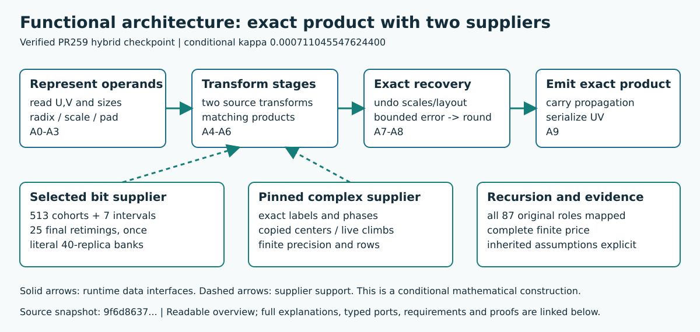

# Architecture Reference and Workflow Diagrams for PR #277

Architecture reference material for the older verified construction checkpoint
in [PR #277](https://github.com/CrocSwap/integer-mult-bounds/pull/277).
Conditional kappa is 0.000711045547624400; the inspected later PR266 checkpoint
is stronger.

[Open the architecture reference PDF](functional_architecture.pdf).
Pages 2–5 contain visual architecture and compiler-workflow views. The other
pages contain contents, explanations, requirements, source references and
coverage limits. This is not a 51-page diagram or a complete wiring schematic.
The local compiler workflow has ten connected blocks; the overview shows the
operand-to-product process with separate supplier support.

## Rebuild the retained architecture

Use Python 3.11+ and a fresh isolated environment:

    python -m pip install -r joint259_system_docs_requirements.txt
    python -B joint259_system_docs_incremental.py --source /path/to/verified/construction --output /new/architecture-build --svg

Use a new output directory outside the construction package. The optional
--svg flag requires Poppler pdftocairo and creates linked per-page architecture
SVGs locally; they are not published in this PR. Without --svg the build uses
Python only. Graphviz is not used. Reuse a --cache path for later builds, or
use --clean to ignore the cache.

The default build emits only the functional PDF family and functional summary.
It also emits local source, requirement and dependency indexes. The public output set contains the functional PDF and summary, QA/runtime
receipts, and generated architecture-dependency, source, requirement, model,
hierarchy and scientific-reproduction indexes: exactly 12 generated artifacts
with 18 static build/support files. EXPECTED_ARTIFACTS.json pins eleven hashes;
the incremental runtime receipt is intentionally environment-specific.
The page cache is local build state and is not a proof receipt.

The retained Python modules and JSON models form the dependency closure for
functional rendering. Separate event/wiring extraction tools, logical/combined render families and
logical previews have been removed from the public package. The original
independent reviews are retained as historical records, with fresh
functional-only test evidence recorded separately. All local originals remain
preserved.

## Verification and scientific boundary

The renderer requires deterministic PDF rebuilds, valid block/port relations,
resolved internal links, nonempty page text and unchanged admitted source
files. QA.json records these finite documentation checks. Inspect changed
pages visually; documentation generation does not replay science.

The public construction manifest is
0af10dcca505cbd913cf1b9220a08b6a62687650ace4e3d1efd093e828e3990e.
Its 117 numerical pins are unchanged from the 143-file archive that freshly
passed all eight mandatory scientific stages. The scientific archive manifest
is 9f6d8637b9a119cfe4566a02ab2d704f23c502e5e4357b40c28ef85a3fd4de89.
The certificate SHA256 is
7eb58ec449c932b7092481746390c776365f302a742836cddef5643c0351802b.

The all-size compiler, chart, routing, prime, recovery and analytic interfaces
remain inherited hypotheses. Functional blocks and arrows summarize roles and
compiler flow; they do not establish a complete physical circuit or prove the
unexpanded theorem internals. Source lineage, licenses and contributor credits
remain in the construction's heritage record.

[Focused cache and navigation verification](joint259_system_docs_incremental_README.md)

    python -B joint259_system_docs_incremental_test.py --source /path/to/verified/construction --raster-dpi 40
